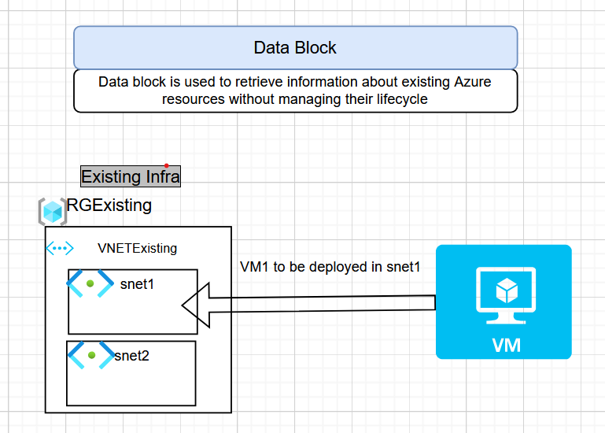

# Data Source Block  
Uderstanding by Example :  Suppose you want to deploy a VM into and already existing RG-VNET-Subnet

   

data "azurerm_resource_group" "rgdata" {
    name = "rg1"
}

data "azurerm_virtual_network" "vnetdata" {
    name = "vnet1"  # actual resource name in cloud 
    resource_group_name = data.azurerm_resource_group.rgdata.name 
}

output "vnet_id" {
    value = data.azurerm_virtual_network.vnetdata.id
}

data "azurerm_subnet" "snetdata" {
    name = "snet1"    # name of subnet  
    resource_group_name = data.azurerm_resource_group.rgdata.name
    virtual_network_name = data.azurerm_virtual_network.vnetdata.name

}

# based on this create a vm

resource "azurerm_network_interface" "nic1" {
  name                = "nic1"
  location            = data.azurerm_resource_group.rgdata.location
  resource_group_name = data.azurerm_resource_group.rgdata.name

  ip_configuration {
    name                          = "internal"
    subnet_id                     = data.azurerm_subnet.snetdata.id
    private_ip_address_allocation = "Dynamic"
  }
}

resource "azurerm_linux_virtual_machine" "example" {
  name                = "example-machine"
  resource_group_name = data.azurerm_resource_group.rgdata.name
  location            = data.azurerm_resource_group.rgdata.location
  size                = "Standard_F2"
  admin_username      = "adminuser"
  network_interface_ids = [ azurerm_network_interface.nic1.id,]

  admin_ssh_key {
    username   = "adminuser"
    public_key = file("~/.ssh/id_rsa.pub")
  }

  os_disk {
    caching              = "ReadWrite"
    storage_account_type = "Standard_LRS"
  }

  source_image_reference {
    publisher = "Canonical"
    offer     = "0001-com-ubuntu-server-jammy"
    sku       = "22_04-lts"
    version   = "latest"
  }
}

#
